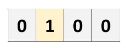

# Q-Learning and Deep Q-Network Tutorial

This notebook contins a solution to a simple Reinforcement Learning problem, solved both using Q-Learning (using a table) and Deep Q-Network.

## The challenge:
The agent must fill all 4 vacant cells of the board. He must not try to fill a non-vacant cell. An empty cell is represented by "0" and a filled cell by "1". In the example
below, only the second cell is filled, and so the agent must select any of the other cells:

## Related blogposts:
This tutorial accompanies the following blogposts:
* [Qrash Course: Reinforcement Learning 101 & Deep Q Networks in 10 Minutes](https://medium.com/@shakedzy/qrash-course-deep-q-networks-from-the-ground-up-1bbda41d3677)
* [Lessons Learned from Tic-Tac-Toe: Practical Reinforcement Learning Tips](https://medium.com/@shakedzy/lessons-learned-from-tic-tac-toe-practical-reinforcement-learning-tips-5cac654a45a8)
